<!-- DOTFILES BANNER -->
<p align="center">
  
</p>

<p align="center">
  <b>🎀 KwesomeDE 🎀</b>
</p>

<p align="center">
<a href="#wrench--setup"></a>
<a href="https://github.com/Kasper24/KwesomeDE/wiki"></a>
<a href="#ocean--gallery"></a>
<a href="#money_with_wings--tip-jar"></a>
</p>


<table>
  <tr>
    <td></td>
     <td></td>
     <td></td>
  </tr>
  <tr>
    <td>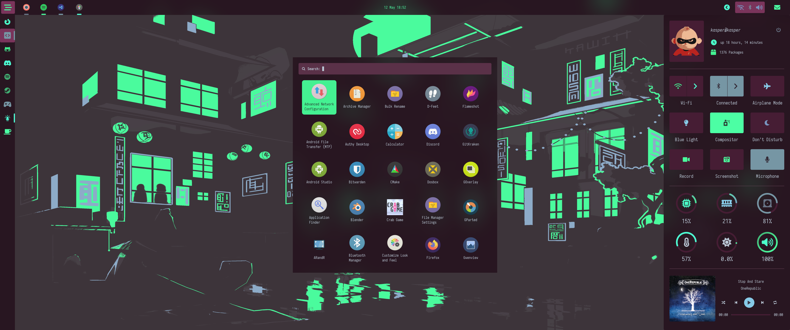
    <td>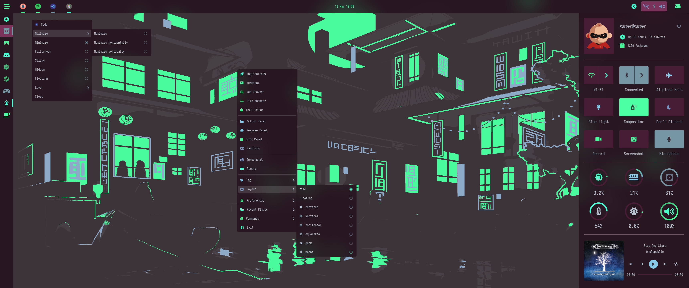</td>
    <td>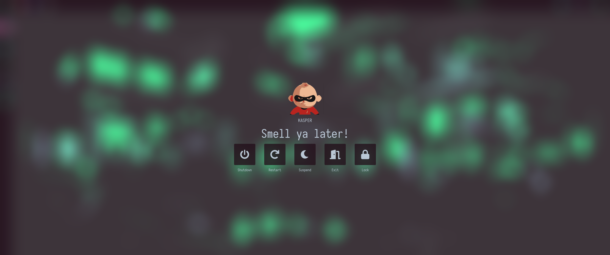</td>
  </tr>
  <tr>
    <td>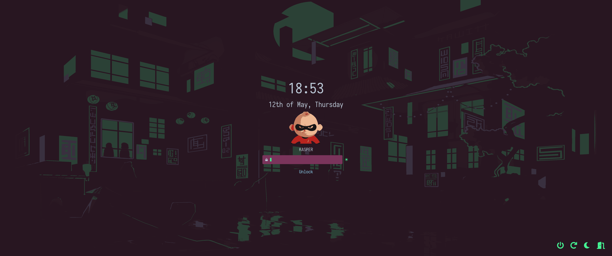
    <td>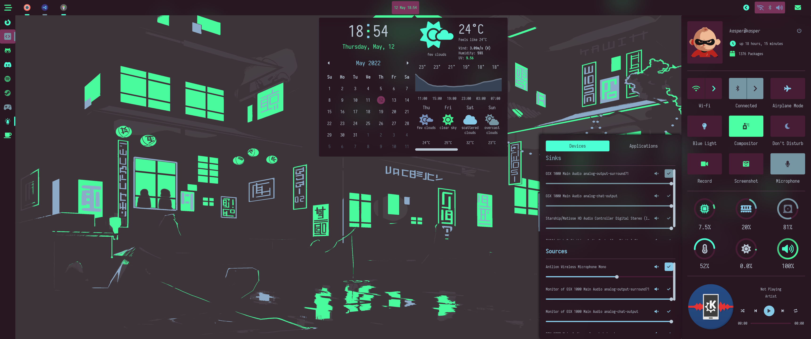
    <td>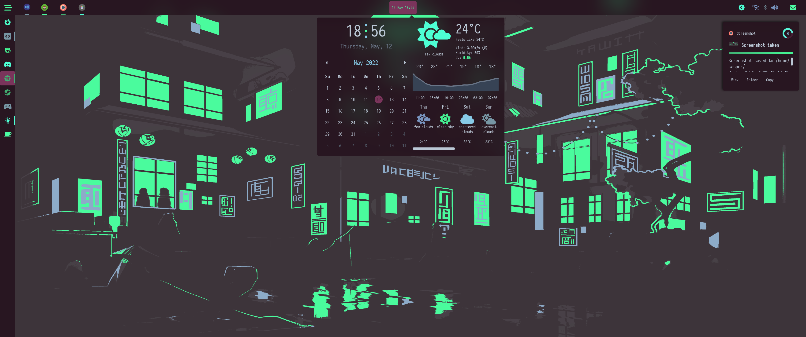
  </tr>
    <tr>
    <td>
    <td>
    <td>
  </tr>
 </table>

## Thanks for dropping by!

<b> Welcome to my AwesomeWM configuration files, aka KwesomeDE.</b>

The [setup section](#setup) will guide you through the installation process.
AwesomeWM is the most powerful and highly configurable, next generation framework window manager for X,
Although it takes time and effort to configure it, but I'm very satisfied with the result.

<!-- INFORMATION -->
## :snowflake: ‎ <samp>Information</samp>

Here are some details about my setup:

- **OS:** [Arch Linux](https://archlinux.org)
- **WM:** [awesome](https://github.com/awesomeWM/awesome)
- **Terminal:** [kitty](https://github.com/alacritty/alacritty)
- **Shell:** [zsh](https://www.zsh.org/)
- **Editor:** [vscode](https://github.com/microsoft/vscode)
- **Compositor:** [picom-dccsillag](https://github.com/dccsillag/picom/tree/implement-window-animations)
- **Music Player** [ncmpcpp](https://github.com/ncmpcpp/ncmpcpp)

Main Features:
- **Wi-Fi Applet**
- **Bluetooth Applet**
- **Audio Applet**
- **CPU Applet**
- **RAM Applet**
- **Disk Applet**
- **Introduction/Setup tool**
- **Screenshot tool**
- **Recorder tool**
- **Theme Manager**
- **Desktop Icons**
- **Control Panel**
- **Message Panel**
- **Info Panel**
- **Main Menu**
- **Client Menu**
- **App Launcher**
- **Lock Screen**
- **Power/Exit Screen**
- **Window Switcher**
- **Notifications for various system events**
- **Titlebars**
- **Ncmpcpp Custom UI**
- **Many more!**

AwesomeWM Modules:
- **[bling](https://github.com/blingcorp/bling)**
   + Adds new layouts, modules, and widgets that try to primarily focus on window management
- **[layout-machi](https://github.com/xinhaoyuan/layout-machi)**
   + Manual layout for Awesome with an interactive editor
- **[color](https://github.com/andOrlando/color)**
   + Contains a bunch of useful function for conversion as well as well as a very nice api for just colors in general.

<!-- SETUP -->
## :wrench: ‎ <samp>Setup</samp>

<details>
<summary><b>1. Install AwesomeWM</b></summary>

Install the **[git version of AwesomeWM](https://github.com/awesomeWM/awesome/) built with LUA 5.3**

**Arch users** can use this following command

```sh
# I edited the awesome-git PKGBUILD to make it build with 5.3
$ wget -q --show-progress https://raw.githubusercontent.com/Kasper24/KwesomeDE/main/PKGBUILD
$ makepkg -si
```

**For other distros**, build instructions are [here](https://github.com/awesomeWM/awesome/#building-and-installation).
</details>

<details>
<summary><b>2. Install Dependencies</b></summary>

| Dependency                              | Why/Where is it needed?                                   |
|-----------------------------------------|-----------------------------------------------------------|
| networkmanager                          | Network notifcations, applet/wibar widget                 |
| blueman                                 | Bluetooth notifcations, applet/wibar widget               |
| pactl                                   | Audio notifcations, applet/wibar widget                   |
| pipewire+pipewire-pulse/pulsaudio       | Used by pactl                                             |
| lm_sensors                              | CPU Temperature                                           |
| inotify-tools                           | Daemons that monitor filesystem events                    |
| redshift                                | Blue light toggle                                         |
| maim                                    | Screenshot widget                                         |
| flameshot                               | Screenshot widget                                         |
| ffmpeg                                  | Record widget                                             |
| xdotool                                 | Menu commands use this to input text into terminal        |
| xclip                                   | Copy screenshot into clipboard/paste text into prompt     |
| farge                                   | Color picker keybind                                      |
| upower                                  | Battery notifications/widgets                             |
| picom                                   | Compositor widget/notifcations                            |
| brightnessctl                           | Brightness daemon and widget                              |
| playerctl                               | Media daemon and controls                                 |
| fortune-mod                             | Fortune daemon (right now that daemon is unused)          |
| xfce4-settings                          | Used in the main menu                                     |
| imagemagick                             | Used to generate colors from wallpapers                   |
| yad                                     | Used to pick a folder                                     |

**Arch Linux (and other Arch-based distributions)**
   ```sh
      pacman -Sy kitty networkmanager blueman pipewire pipewire-pulse lm_sensors inotify-tools
      redshift maim ffmpeg xdotool xclip upower brightnessctl playerctl fortune-mod flameshot
      xfce4-settings imagemagick yad --needed
   ```
   Assuming your **AUR Helper** is [yay](https://github.com/Jguer/yay) or [paru](https://github.com/Morganamilo/paru).
   ```sh
      yay/paru -Sy picom-animations-git farge-git --needed
   ```
</details>

<details>
<summary><b>3. Install Fonts</b></summary>

   + **Font Awesome 6 Pro**              - PAID
   + **Nerd Font Mono**              - [here](https://github.com/ryanoasis/nerd-fonts)
   + **Iosevka**       - [here](https://github.com/be5invis/Iosevka)
   + **Oswald**   - [here](https://fonts.google.com/specimen/Oswald)

Once you download them and unpack them, place them into `~/.fonts` or `~/.local/share/fonts`

And run this command for your system to detect the newly installed fonts.

   ```sh
   fc-cache -v
   ```
</details>


<details>
<summary><b>4. Install KwesomeDE</b></summary>

> Clone this repository

   ```sh
   git clone --recurse-submodules https://github.com/Kasper24/KwesomeDE ~/.config/awesome
   ```

> Finally, now you can login with AwesomeWM

   Congratulations, at this point you have installed this aesthetic dotfiles! :tada:

   Log out from your current desktop session and log in into AwesomeWM
</details>

<!-- Keybinds -->
## ⌨️ ‎ <samp>Keybinds</samp>

<details>
<summary><b>Awesome</b></summary>

| Keybind | Action |
| ------- | ------ |
| <kbd>super + r </kbd> | Reload awesome |
| <kbd>super + q</kbd> | Quit awesome |
</details>

<details>
<summary><b>Screen</b></summary>

| Keybind | Action |
| ------- | ------ |
| <kbd>super + ctrl + j </kbd> | Focus the next screen |
| <kbd>super + ctrl + k</kbd> | Focus the previous screen |
</details>

<details>
<summary><b>Client</b></summary>

| Keybind | Action |
| ------- | ------ |
| <kbd>super + c</kbd> | Close client |
| <kbd>super + t</kbd> | Toggle titlebar |
| <kbd>super + space</kbd> | Toggle floating |
| <kbd>super + f</kbd> | Toggle fullscreen |
| <kbd>super + m</kbd> | Toggle maximize client |
| <kbd>super + ctrl + m</kbd> | Toggle maximize client vertically |
| <kbd>super + shift + m</kbd> | Toggle maximize client horizontally |
| <kbd>super + n</kbd> | Minimize client |
| <kbd>super + shift + n</kbd> | Restore minimized clients |
| <kbd>super + shift + b</kbd> | Make tiny float and keep on top |
| <kbd>super + shift + c</kbd> | Move and resize to center |
| <kbd>super + c</kbd> | Center a client |

| <kbd>super + shift + up</kbd> | Move up |
| <kbd>super + shift + down</kbd> | Move down |
| <kbd>super + shift + left</kbd> | Move left |
| <kbd>super + shift + right</kbd> | Move right |
| <kbd>super + ctrl + up</kbd> | Resize up |
| <kbd>super + ctrl + down</kbd> | Resize down |
| <kbd>super + ctrl + left</kbd> | Resize left |
| <kbd>super + ctrl + right</kbd> | Resize right |
| <kbd>super + up</kbd> | Focus up |
| <kbd>super + down</kbd> | Focus down |
| <kbd>super + left</kbd> | Focus left |
| <kbd>super + right</kbd> | Focus right |
| <kbd>super + j</kbd> | Focus next |
| <kbd>super + k</kbd> | Focus previous |
| <kbd>super + shift + k</kbd> | Swap with next |
| <kbd>super + shift + j</kbd> | Swap with previous |
| <kbd>super + shift + return</kbd> | Swap focused client with master |
| <kbd>super + tab</kbd> | Go back in history |
| <kbd>super + shift + u</kbd> | Jump to urgent |

| <kbd>alt + a</kbd> | pick client to add to tab group |
| <kbd>alt + s</kbd> | iterate through tabbing group |
| <kbd>alt + d</kbd> | remove focused client from tabbing group |

</details>

<details>
<summary><b>Layout</b></summary>

| Keybind | Action |
| ------- | ------ |
| <kbd>super + shift + =</kbd> | increase paddings |
| <kbd>super + shift + -</kbd> | decrease paddings |
| <kbd>super + =</kbd> | increase gaps |
| <kbd>super + -</kbd> | decrease gaps |
| <kbd>super + ctrl + h</kbd> | increase number of columns |
| <kbd>super + ctrl + l</kbd> | decrease number of columns |
| <kbd>super + shift + h</kbd> | increase number of master clients |
| <kbd>super + shift + l</kbd> | decrease number of master clients |
| <kbd>super + h</kbd> | increase master width |
| <kbd>super + l</kbd> | decrease master width |
| <kbd>super + .</kbd> | Edit the current layout if it is a machi layout |
| <kbd>super + /</kbd> | Switch between windows for a machi layout |
</details>

<details>
<summary><b>Tags</b></summary>

| Keybind | Action |
| ------- | ------ |
| <kbd>super + [1-9]</kbd> | View tag |
| <kbd>super + [1-9]</kbd> | Toggle tag |
| <kbd>super + shift + [1-9]</kbd> | Move focused client to tag |
| <kbd>super + ctrl + [1-9]</kbd> | Move focused client and switch to tag |
| <kbd>super + s</kbd> | View none |
</details>

<details>
<summary><b>Media</b></summary>

| Keybind | Action |
| ------- | ------ |
| <kbd>XF86AudioPlay</kbd> | Toggle media |
| <kbd>XF86AudioPrev</kbd> | Previous media |
| <kbd>XF86AudioNext</kbd> | Next media |
| <kbd>XF86AudioMute</kbd> | Mute volume |
| <kbd>XF86MonBrightnessUp</kbd> | Increase brightness |
| <kbd>XF86MonBrightnessDown</kbd> | Decrease brightness |
| <kbd>print</kbd> | Screenshot widget |
| <kbd>super + p</kbd> | Color picker |
</details>

<details>
<summary><b>UI</b></summary>

| Keybind | Action |
| ------- | ------ |
| <kbd>super + d</kbd> | Toggle app launcher |
| <kbd>super + escape</kbd> | Toggle exit screen |
| <kbd>alt + tab</kbd> | Window switcher |
| <kbd>super + F1</kbd> | Toggle hotkeys |
</details>

## ⌨️ ‎ <samp>Mousebinds</samp>

<details>
<summary><b>Desktop</b></summary>

| Mousebind | Action |
| --------- | ------ |
| `right click` | Toggle main menu |
</details>

<details>
<summary><b>Client</b></summary>

| Mousebind | Action |
| --------- | ------ |
| `left click` | Focus a client |
| super + `left click` | Make a client floating and move it |
| super + `right click` | Make a client floating and resize it |
</details>

<!-- GALLERY -->
## :ocean: ‎ <samp>Gallery</samp>

| <b>Action Panel </b> |
| --- |
| 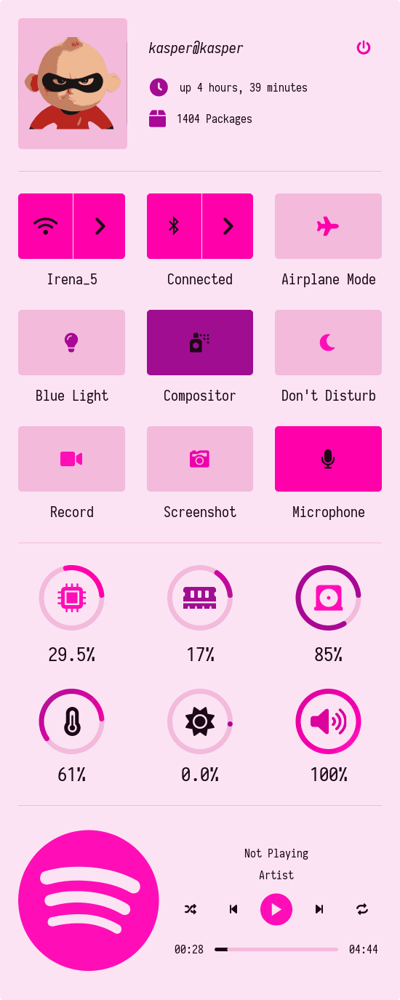 |

| <b>Message Panel </b> |
| --- |
| 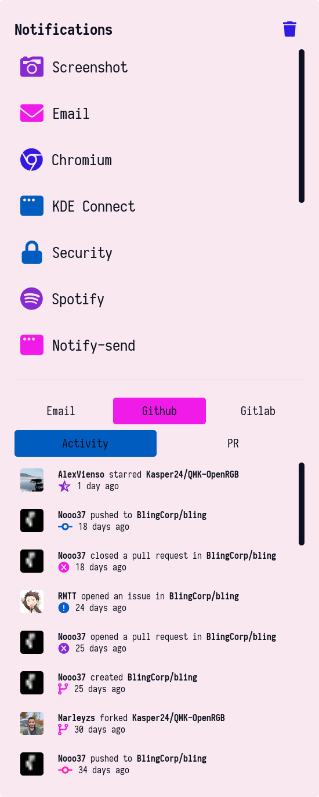 |

| <b>Info Panel </b> |
| --- |
|  |

| <b>Wi-Fi Applet</b> |
| --- |
| 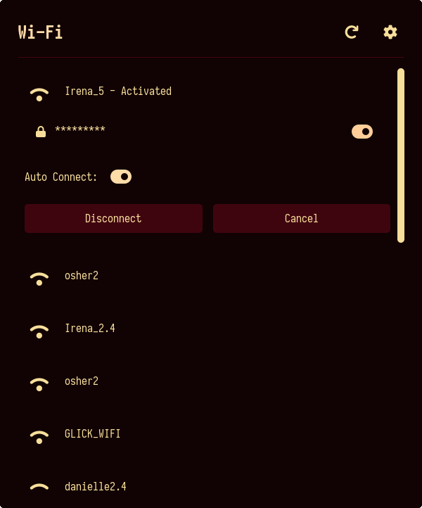 |

| <b>Bluetooth Applet</b> |
| --- |
| 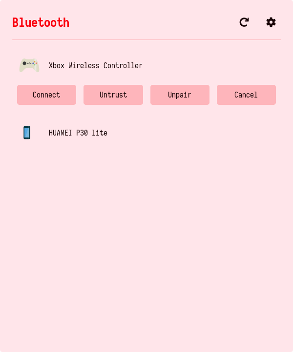 |

| <b>Audio Applet</b> |
| --- |
| 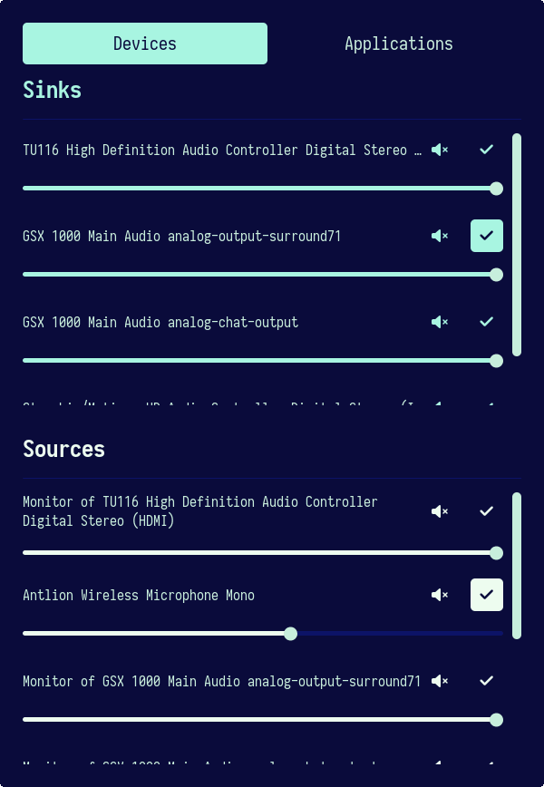 |

| <b>CPU Applet</b> |
| --- |
| 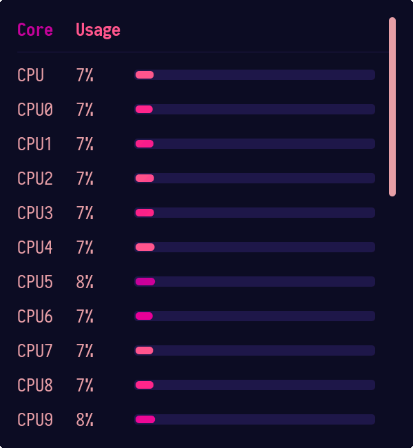 |

| <b>Theme Manager</b> |
| --- |
| 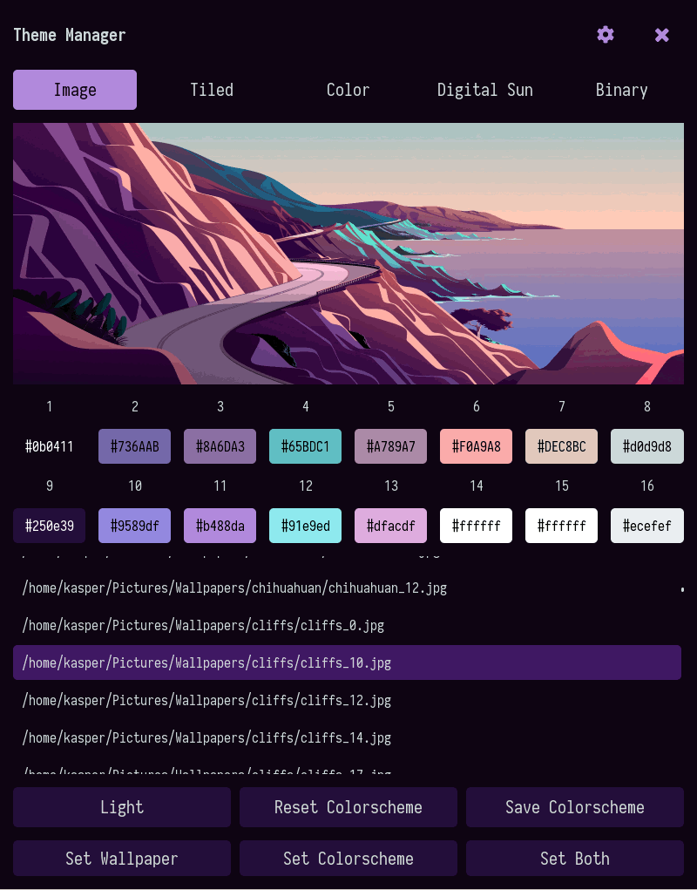 |

| <b>Screenshot Tool</b> |
| --- |
| 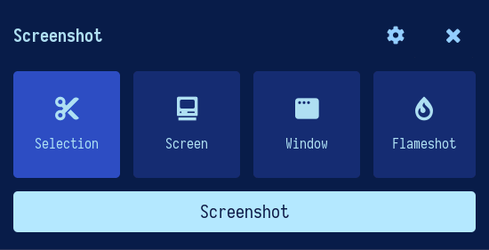 |

| <b>Recorder Tool</b> |
| --- |
| 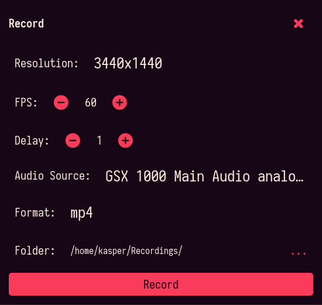 |

| <b>Power Screen</b> |
| --- |
| 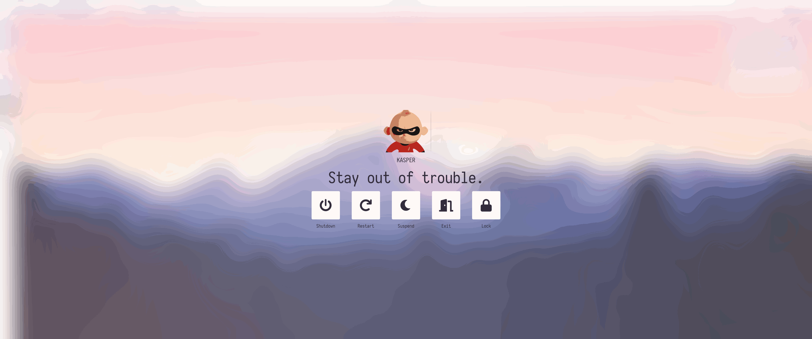 |

| <b>Lock Screen</b> |
| --- |
| 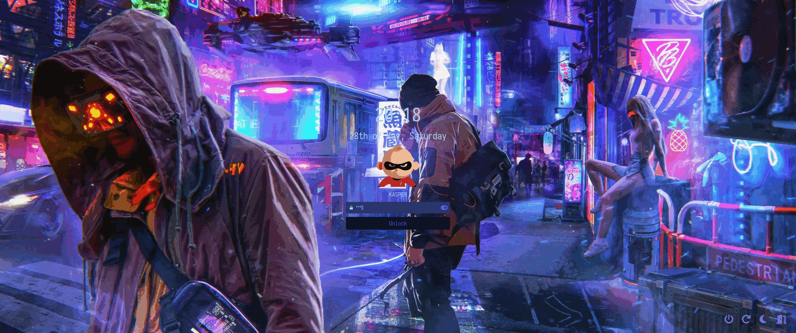 |

| <b>Main Menu</b> |
| --- |
| 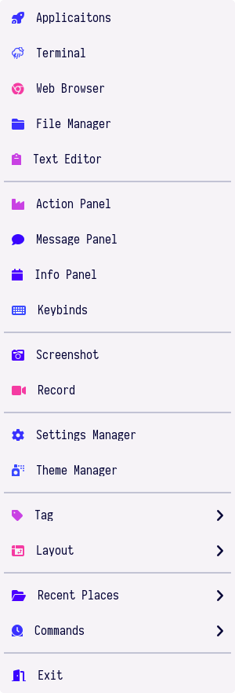 |

| <b>Client Menu</b> |
| --- |
| 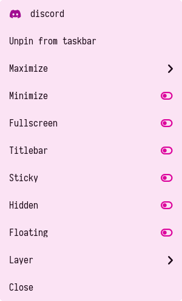 |

| <b>Notification</b> |
| --- |
| 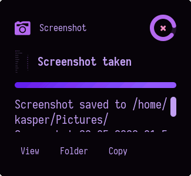 |

| <b>ncmpcpp</b> |
| --- |
| 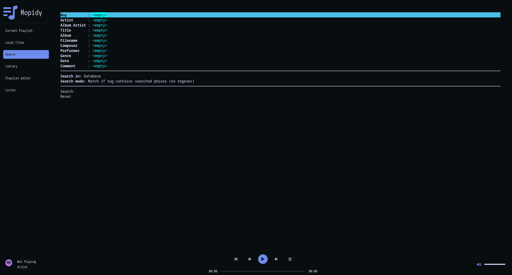 |

<!-- ACKNOWLEDGEMENTS -->
## :bulb: ‎ <samp>Acknowledgements</samp>

- **Special thanks to**
    - [`rxyhn`](https://github.com/rxyhn/dotfiles)
    - [`awesome-widgets`](https://github.com/streetturtle/awesome-wm-widgets)
    - [`JavaCafe01`](https://github.com/JavaCafe01)
    - [`andOrlando`](https://github.com/andOrlando/awesome-widgets)
    - [`actionless`](https://github.com/actionless)
    - [`Aire-One`](https://github.com/Aire-One)
    - [`elenapan`](https://github.com/elenapan)
    - [`manilarome`](https://github.com/manilarome)
    - [`Mofiqul`](https://github.com/Mofiqul)
<br>